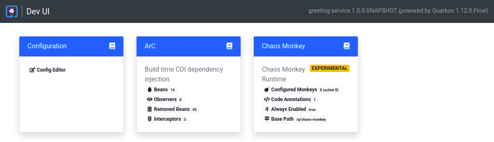
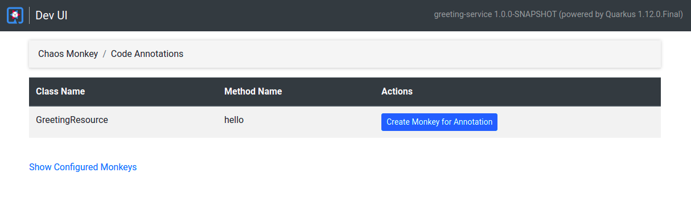
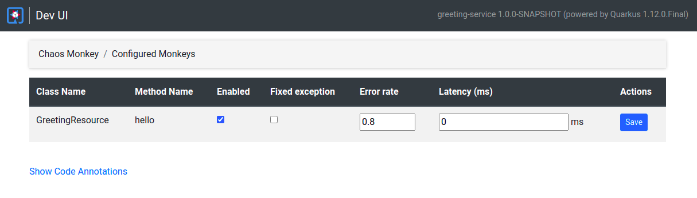

# Quarkus Chaos-Monkey Extension

Simple chaos-monkey extension for quarkus currently in experimental state.

The extension will let you inject errors to methods annotated with `@ChaosMonkey`. The chaos-monkeys are configurable
using the Dev-UI integration or the provided RESTful API `/q/chaos-monkey`. 

## Chaos Monkey Types

| Error Type    | Executed      | Description  |
|:------------- |:------------- |: ------------|
| Latency       | After method  | Issues a `Thread.sleep()` in ms. Default: `0` |
| ErrorRate     | After method  | Lets you specify a percentage of errors thrown (0 to 1). Default: `0` |
| Exception     | After method  | Always triggers an exception if enabled. Default: `false` |

## RESTful API

Simple Request to configure a chaos monkey

```
curl --request POST \
  --url http://127.0.0.1:8080/q/chaos-monkey \
  --header 'Content-Type: application/json' \
  --data '[
  {
    "clazzName": "GreetingResource",
    "methodName": "hello",
    "enabled": true,
    "latencyMs": 0,
    "errorRate": 0.8,
    "throwException": false
  }
]'
```

Fetch all configured monkeys
```
curl --request GET \ 
  --url http://127.0.0.1:8080/q/chaos-monkey
```


## Dev-UI Integration
Extension Overview



### Code Annotations
Lists all methods annotated with `@ChaosMonkey` and lets you add a monkey for this annotation.



### Configured Monkeys
Lists all configured monkeys. Lets you reconfigure or disable a specific monkey.




## Configuration Properties

### Build-Time properties

| Configuration Property                                            | Type          | Default      |
|:----------------------------------------------------------------- |:------------- |: ------------|
| `quarkus.chaos-monkey.always-enabled`<br > By default this extension will only be included in dev and test. Setting this to `true` will also include this in Prod. | boolean       | `false`      |
| `quarkus.chaos-monkey.base-path`<br > The base path for the application    | String  | `/chaos-monkey` |


### Run-Time properties

| Configuration Property                                            | Type          | Default      |
|:----------------------------------------------------------------- |:------------- |: ------------|
| `quarkus.chaos-monkey.enabled`<br > If Chaos-Monkey should be enabled. By default, Chaos-Monkey is enabled if it is included (see `always-include`).   | boolean       | `true`      |

